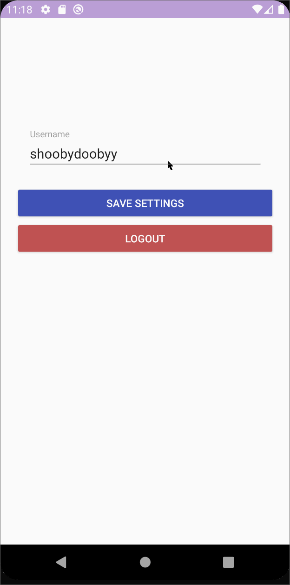

# Todo

## Table of Contents
1. [Overview](#Overview)
1. [Product Spec](#Product-Spec)
1. [Wireframes](#Wireframes)
2. [Schema](#Schema)

## Overview
### Description

A gamified To-Do list app in which you take care of a virtual pet named Todo!

### App Evaluation
- **Category:** Productivity, Self-care, Lifestyle
- **Mobile:** Push notifications for task deadlines, camera capture for task verification
- **Story:** The app would have a clear value
- **Market:** Everyone can use this app to complete their tasks! It appeals to people of all ages, because everyone loves pets. It provides a support system for people who are seeking to improve their productivity.
- **Habit:** Users would login daily. They don't simply consume content but they interact with the app.
- **Scope:** This app would be moderately challenging to complete. A version with less integral features would still be interesting to build. It's pretty defined.

## Product Spec

### 1. User Stories (Required and Optional)

**Required Must-have Stories**

- [x] Create an account
- [x] Login and logout
- [ ] Create and get reminders for a scheduled task in your to-do list
- [ ] Choose a pet + features
- [ ] See pet, pet status, pet features
- [ ] Add pre-defined tasks (cleaning, eating, exercise, waking, sleeping)?
- [ ] private task completion results in pet happiness increase
- [ ] public task completion results in pet happiness increase + points
- [ ] Buddy system approval of tasks + sending pictures
- [ ] Update pet status and task bars to match completed tasks

**Optional Nice-to-have Stories**

* [ ] Points system
* [ ] Points are given for public posts
* [ ] Buying food with points
* [ ] Miscellaneous: ability to pet/interact with your pet
* [ ] Friends List

**Walkthroughs**





GIF created with [LiceCap](http://www.cockos.com/licecap/).


### 2. Screen Archetypes

* Login Screen
   * Create an account
   * Login and logout
* Pet Screen
   * Choose a pet + features
   * See pet, pet status, pet features
* Task Screen
    * See tasks to do
    * See past tasks?
    * Buddy system approval of tasks + sending pictures
* Buddy Approval Screen
    * Scroll through people's uploaded photos and approve/deny tasks

### 3. Navigation

**Tab Navigation** (Tab to Screen)

* To-Do list tab
* Buddy system tab
* Pet! tab

**Flow Navigation** (Screen to Screen)

* Login
   * To-Do list preferences
* Pet 
   * Shop
* To-do List
    * Task Details
    * Pet

## Wireframes


### [BONUS] Digital Wireframes & Mockups

### [BONUS] Interactive Prototype

## Schema 
### Models
**User**
| Property | Type | Description |
| -------- | -------- | -------- |
|  username  | string| The user's name |
| password |string| The user's password|
|points | int | The user's points|
| createdAt| DateTime | When the user was created |
| pet | pointer to [Pet] | The user's pet |
| todoList | pointer to [To-do List] | List of the user's tasks |


**Task**
| Property | Type | Description |
| -------- | -------- | -------- |
| author     | pointer to [User]     | pointer to the user who created the task     |
| public    | bool     | whether the item is public or not and set for approval    |
| due date   | DateTime     | when a task should be completed by     |
| photo    | file    | photo uploaded to prove a task has been done     |
| description    | string   | a description of the task   |
| complete    | boolean    | if a task has been completed or not     |
|approved|bool|whether a task has been approved by another user or not

**Pet**
| Property | Type | Description |
| -------- | -------- | -------- |
|happiness  | float    | measures the "happiness" level of a pet |
|models  |List| a list of the different animations/models a pet will use to display the happiness meter|

**Store**

| Property | Type | Description |
| -------- | -------- | -------- |
| fancy food    | list of pointer to [Fancy Food]     | fancy food to buy with user points for the pet    |

**Fancy Food**


| Property | Type | Description |
| -------- | -------- | -------- |
| name    | String    | the name of the food     |
| image | file | image of the fancy food| 
| cost | int | the cost for the fancy food |
| effectiveness| int | how much happiness your pet will gain feeding this food|

### Networking
* **Signup/Login Screen**
    * (GET) [User] object
    ```java
    ParseUser.logInInBackground(username, password, new LogInCallback() {
        @Override
        public void done(ParseUser user, ParseException e) {
        if(e!=null){
            Log.e(TAG, "issue with login", e);
            Toast.makeText(LoginActivity.this, "Issue with Login!", Toast.LENGTH_SHORT).show();
            return;
        }
        
        goMainActivity();
        Toast.makeText(LoginActivity.this, "Success", Toast.LENGTH_SHORT).show();
        }
    });
    ```
    
    * (Create/POST) create new [User] 
        ```java
        ParseUser user = new ParseUser();
        user.setUsername(username);  
        user.setPassword(password);
        user.signUpInBackground(new SignUpCallback() {
                public void done(ParseException e) {
                    if (e == null) {
                     // do something
                    } else {
                        Log.e(TAG, "Issue with signup: ", e);
                        Toast.makeText(LoginActivity.this, "Issue with signup", Toast.LENGTH_SHORT).show();
                        return;
                    }
                }
            });
         ```              
* **Pet Screen**
    * (Update/PUT) points when public tasks are approved by other users
    ```java
    ParseUser.getCurrentUser().put("points", newPoints);
    ```
    * (Read/GET) points
    ```java
    ParseUser.getCurrentUser().get("points");
    ```
    * (Update/PUT) when points are used at the store
    ```java
    ParseUser.getCurrentUser().put("points", newPoints);
    ```
    
* **Task Screen**
    * (Create/POST) Create new [Task] object
    ```java
    Task task = new Task();
    task.put("author", user.getUsername());
    task.put("description", myDesc);
    task.put("public", myBool);
    task.put("duedate", myDate);
    task.saveInBackground(e -> {
    if (e == null){
      //Save was done
    }else{
      //Something went wrong
      Toast.makeText(this, e.getMessage(), Toast.LENGTH_SHORT).show();
    }
  });
        
    ```
    * (Read/GET) all tasks from the user
    ```java
        ParseQuery<Task> query = ParseQuery.getQuery(Task.class);
        query.include(Task.KEY_USER);
        query.whereEqualTo(Task.KEY_USER, ParseUser.getCurrentUser()); 
        query.addDescendingOrder(Task.KEY_CREATED_KEY);
        query.findInBackground(new FindCallback<Task>() {
            @Override
            public void done(List<Task> tasks, ParseException e) {
                if(e!= null){
                    Log.e(TAG, "Issue with getting tasks");
                    return;
                }
                allTasks.addAll(tasks);
                adapter.notifyDataSetChanged();
            }
        });
    ```
    * (Update/PUT) Specific tasks when edited
        ```java
        // Retrieve the object by id
        query.getInBackground(myTask, new GetCallback<ParseObject>() {
          public void done(List<Task> tasks, ParseException) {
            if (e == null) {
                myTask.put("description", "Clean the house!");
                myTask.put("image", "myImage.jpeg");
                myTask.put("due date", myNewDateTime);
                myTask.saveInBackground();
            }
          }
        });

        ```
    * (Delete) Delete/remove a task
        ```java
        // Retrieve the object by id
        query.getInBackground(myTask, new GetCallback<ParseObject>() {
          public void done(Post post, ParseException) {
            if (e == null) {
                myTask.deleteInBackground();
            }
          }
        });

        ```
* **Buddy Approval Screen**
    * (Read/GET) Query all public tasks from other users that have not yet been approved

    ```java
    ParseQuery<Task> query = ParseQuery.getQuery(Task.class);
        query.include(Task.KEY_USER);
        query.whereEqualTo(KEY_APPROVED, "false");
        query.setLimit(20);
        query.findInBackground(new FindCallback<Task>() {
        @Override
        public void done(List<Task> tasks, ParseException e) {
            if (e != null) {
                Log.e(TAG, "Issue with getting tasks from all users without approval", e);
                return;
                }
            for (Task task: tasks){
                allPosts.addAll(tasks);
                adapter.notifyDataSetChanged();

                }
            });
        }
    ```
    
    * (Read/GET) Query pending tasks created by the user that have not yet been approved
    ```java 
    ParseQuery<Task> query = ParseQuery.getQuery(Task.class);
        query.include(Task.KEY_USER);
        query.whereEqualTo(Task.KEY_USER, ParseUser.getCurrentUser());
        query.whereEqualTo(KEY_APPROVED, "false");
        query.setLimit(20);
        query.findInBackground(new FindCallback<Task>() {
        @Override
        public void done(List<Task> tasks, ParseException e) {
            if (e != null) {
                Log.e(TAG, "Issue with getting tasks from current user without approval", e);
                return;
                }
            for (Task task: tasks){
                allPosts.addAll(tasks);
                adapter.notifyDataSetChanged();

                }
            });
        }
    ```
    * (Update/PUT) tasks when approved/denied
    ```java
    // Retrieve the object by id
    query.getInBackground(myTask, new GetCallback<ParseObject>() {
      public void done(Task task, ParseException) {
        if (e == null) {
            myTask.put("approved", true);
            myTask.saveInBackground();
        }
      }
    });

    ```
